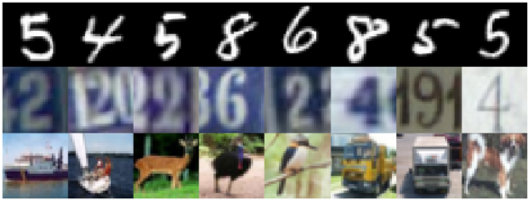
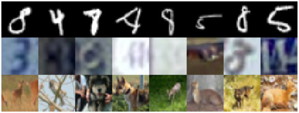

# Open-Set Recognition Using Intra-Class Splitting

This repository contains an implementation of an open-set recognition method using deep learning. The method was proposed in our "Open-Set Recognition Using Intra-Class Splitting" paper presented at the IEEE European Signal Processing Conference 2019. It is based on intra-class splitting, i.e. splitting given normal samples into typical and atypical subsets:

<p align="center">



</p>

## Paper
[Open-Set Recognition Using Intra-Class Splitting](https://arxiv.org/abs/1903.04774)  
by Patrick Schlachter, Yiwen Liao and Bin Yang  
Institute of Signal Processing and System Theory, University of Stuttgart, Germany  
IEEE European Signal Processing Conference 2019 in A Coruña, Spain

If you use this work for your research, please cite our paper:
```
@inproceedings{schlachter2019osr,
	author={Patrick Schlachter, Yiwen Liao and Bin Yang},
	booktitle={2019 IEEE European Signal Processing Conference (EUSIPCO)},
	title={Open-Set Recognition Using Intra-Class Splitting},
	year={2019},
	month={September},
}
```

## Repository
### `models`
Contains build and train functions of the underlying neural network models.

### `toolkits`
Contains evaluation, visualization and util functions.

### `main.py`
The main function to start training and evaluation.

### `packages.py`
Imports necessary Python packages.